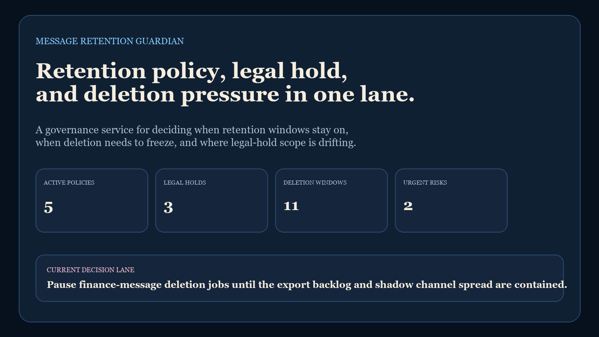
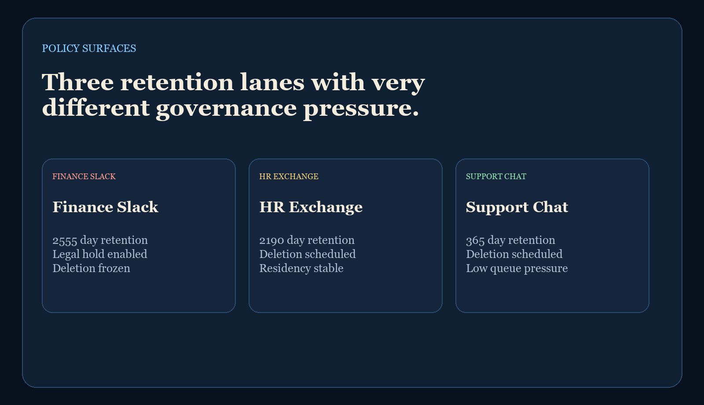
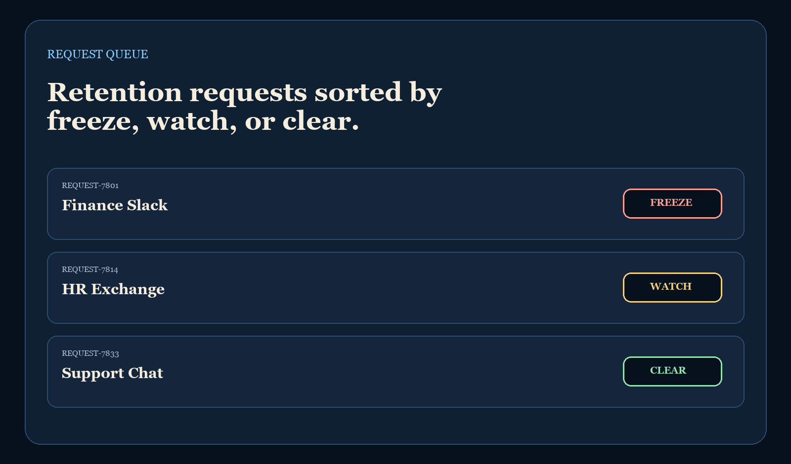
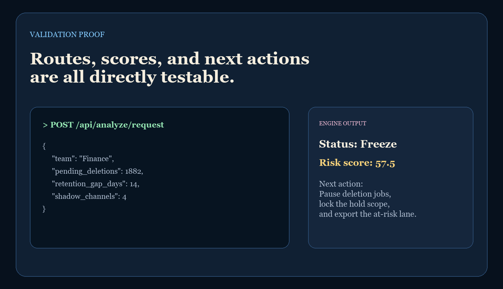

# Message Retention Guardian

`message-retention-guardian` is a Ruby backend for retention policy enforcement, legal hold protection, deletion scheduling, and audit-safe message lifecycle governance.

It is built to feel operational, not theoretical: when a deletion window is about to run against a lane with legal-hold drift, export backlog, or shadow-channel spread, the service scores the pressure and tells operators whether to freeze, watch, or clear the request.

## Screenshots

### Hero


### Policy Surfaces


### Request Queue


### Validation Proof


## Endpoints

- `GET /`
- `GET /docs`
- `GET /api/dashboard/summary`
- `GET /api/sample`
- `GET /api/policies`
- `GET /api/requests/:id`
- `POST /api/analyze/request`

## Local Run

```powershell
cd message-retention-guardian
$env:Path = "C:\Ruby33-x64\bin;$env:Path"
bundle install
bundle exec ruby server.rb
```

If port `4541` is occupied:

```powershell
$env:PORT = "4545"
bundle exec ruby server.rb
```

Then open:

- [http://127.0.0.1:4541/](http://127.0.0.1:4541/)
- [http://127.0.0.1:4541/docs](http://127.0.0.1:4541/docs)

## Validation

```powershell
cd message-retention-guardian
$env:Path = "C:\Ruby33-x64\bin;$env:Path"
bundle install
bundle exec ruby tests\test_analysis.rb
py -3.11 scripts\smoke_check.py
py -3.11 scripts\render_readme_assets.py
```

## Repo Layout

- [server.rb](./server.rb)
- [lib/message_retention_guardian/app.rb](./lib/message_retention_guardian/app.rb)
- [lib/message_retention_guardian/analysis.rb](./lib/message_retention_guardian/analysis.rb)
- [lib/message_retention_guardian/sample_data.rb](./lib/message_retention_guardian/sample_data.rb)
- [docs/architecture.md](./docs/architecture.md)

---

**Connect:** [LinkedIn](https://www.linkedin.com/in/mirzacausevic/) · [Kinetic Gain](https://kineticgain.com) · [Medium](https://medium.com/@mizcausevic/) · [Skills](https://mizcausevic.com/skills/)
